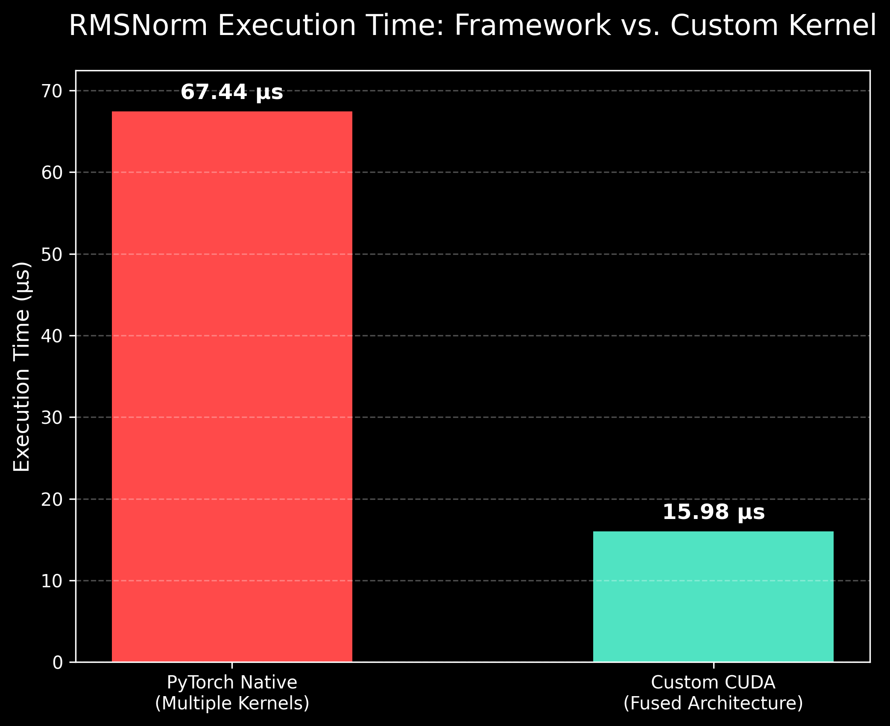
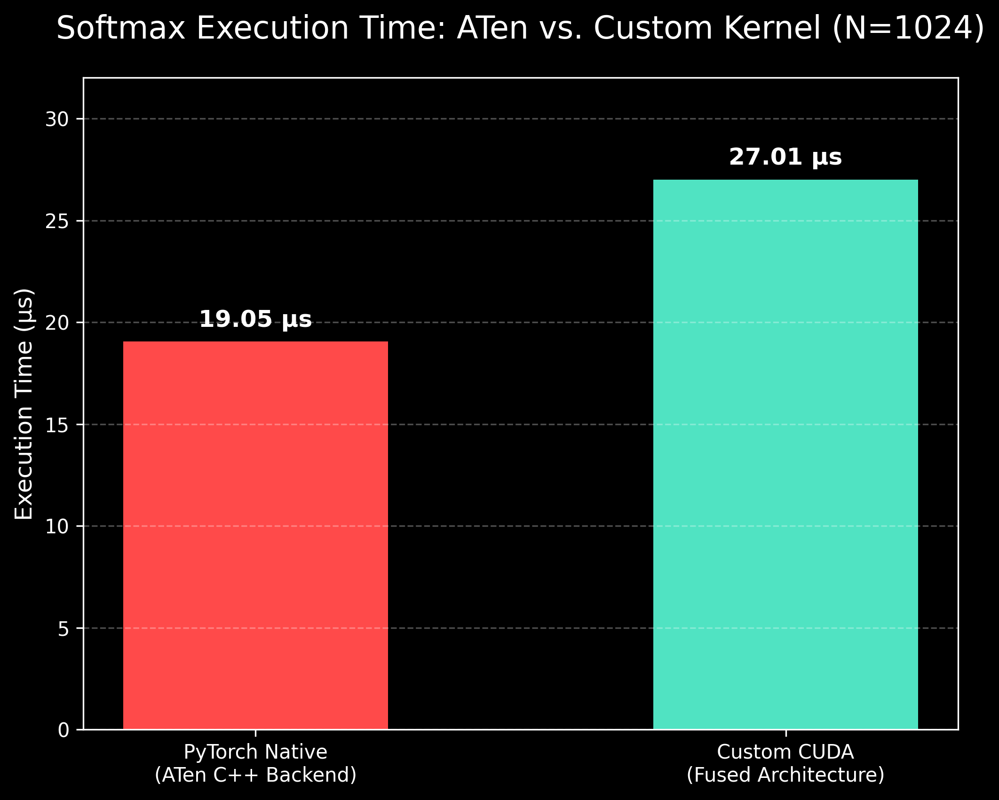

# Bare-Metal CUDA LLM Architecture: Fused Memory Kernels

## Overview
This repository contains custom, highly optimized C++ CUDA implementations of critical Large Language Model (LLM) inference layers and training optimizers. Native machine learning frameworks often execute these operations using Eager Mode, launching multiple sequential kernels that create massive VRAM memory bandwidth bottlenecks. 

These custom implementations utilize **Kernel Fusion** and **Cooperative Shared Memory Reductions** to keep intermediate math strictly within the Streaming Multiprocessor (SM), drastically reducing memory reads/writes and accelerating execution time.

---

## 1. Fused RMSNorm (Root Mean Square Normalization)
Standard Layer Normalization is a massive bottleneck in models like LLaMA 3. Native PyTorch executes RMSNorm across four separate kernel launches (Square, Mean, Inverse Square Root, Multiply). This implementation fuses all operations into a single bare-metal CUDA kernel. 

### Architectural Highlights
* **Cooperative Thread Reduction:** Utilizes `__shared__` memory and an $O(\log N)$ parallel tree-reduction algorithm (`stride >>= 1`) to cooperatively sum layer activations without global memory atomics.
* **Total Memory Fusion:** Bypasses intermediate VRAM allocations entirely. Threads load from VRAM exactly once, compute the sum of squares, perform the root-inverse scaling, and broadcast the final values back to VRAM in a single pass.

### Performance
Benchmarked against native PyTorch Eager Mode on a standard LLM hidden dimension `[Batch: 64, Layer Size: 4096]`.
* **PyTorch Native:** 67.44 µs
* **Custom CUDA Kernel:** 15.98 µs
* **Result:** **4.22x Speedup** achieved purely through memory bandwidth optimization.



---

## 2. Fused Numerically Stable Softmax
Softmax calculation is highly susceptible to floating-point overflow (`NaN` or `inf`) when dealing with large logits. This kernel implements a numerically stable Softmax by fusing two separate parallel reductions into a single pass, going head-to-head with PyTorch's highly optimized `ATen` backend.

### Architectural Highlights
* **Double-Reduction Pipeline:** Orchestrates two consecutive $O(\log N)$ tree reductions within the same block. Pass 1 utilizes `fmaxf` to identify the global maximum for numerical stability. Pass 2 calculates the exponential sum. 
* **Multi-Barrier Synchronization:** Manages complex block state using strict `__syncthreads()` barriers, ensuring the max-value broadcast is fully resolved before the exponential phase begins.
* **Zero-Padded Masking:** Implements safe `-INFINITY` masking for out-of-bounds threads to prevent corrupted max-pooling when layer dimensions do not perfectly align with block boundaries.

### Known Hardware Limitations & Future Profiling
*Note: This specific Softmax implementation is currently bounded by maximum block dimensions (`N <= 1024`) and relies heavily on cooperative shared memory. Production profiling reveals that scaling to massive dimensions (`N = 4096`) requires transitioning to Thread Coarsening algorithms and Warp-Level Primitives (`__shfl_down_sync`) to match the extreme vectorization speeds of PyTorch's proprietary ATen backend. This is mapped for a future architecture update.*



---

## Prerequisites
Ensure you have a CUDA-capable GPU and the Ninja build system installed for PyTorch C++ JIT compilation:
```bash
pip install ninja